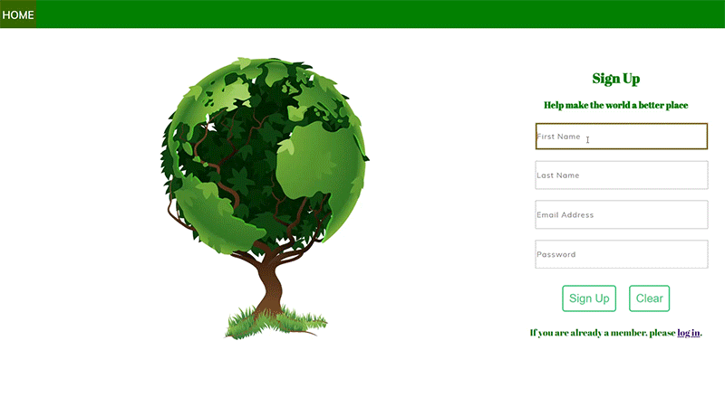
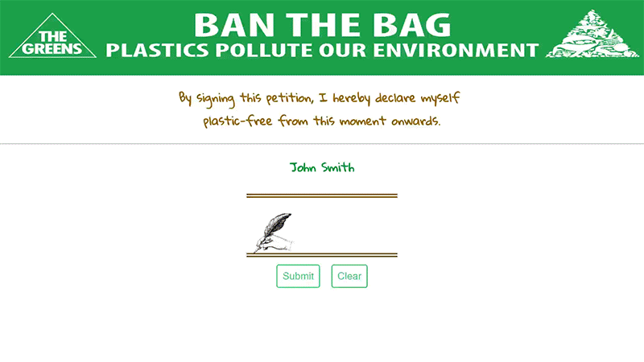
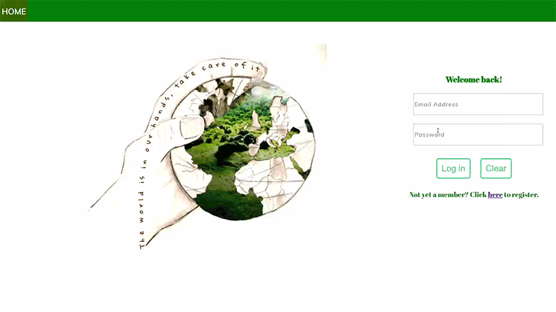

# Full-Stack Petition Project

### Table of contents

*   [Overview](#overview)
*   [Demo](#demo)

### Overview

This is a Full-Stack web petition app where people can register/log-in and sign the petition to ban the use of plastic. 
You can see other signees as well and edit your profile.  
Technologies used:
*   HTML/CSS
*   Javacript
*   Node/Express
*   PostgreSQL
*   Express Handlebars
### Demo

 
 

 
 

